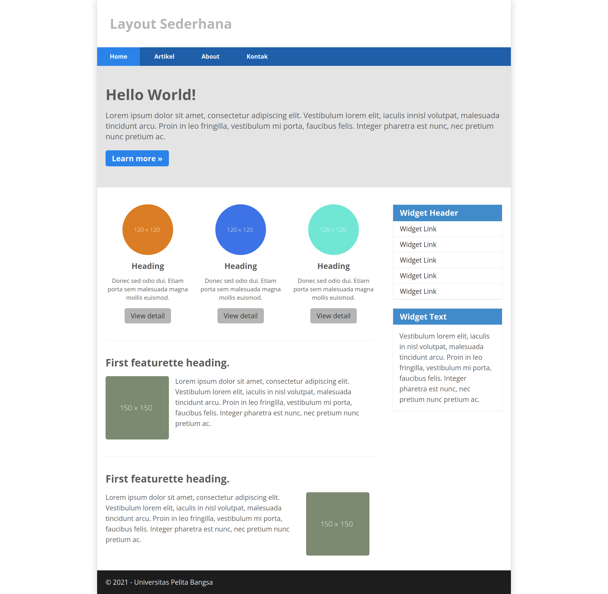

# Tugas Pemograman Web 2 (Layout Sederhana)
## Profil
| #               | Biodata               |
| --------------- | --------------------- |
| **Nama**        | Bhagas Shaib Pramono  |
| **NIM**         | 312110406             |
| **Kelas**       | TI.21.A.1             |
| **Mata Kuliah** | Pemrograman Web 2     |

- Buatlah layout sederhana dengan menggunakan HTML dan CSS

## Terima Kasih
